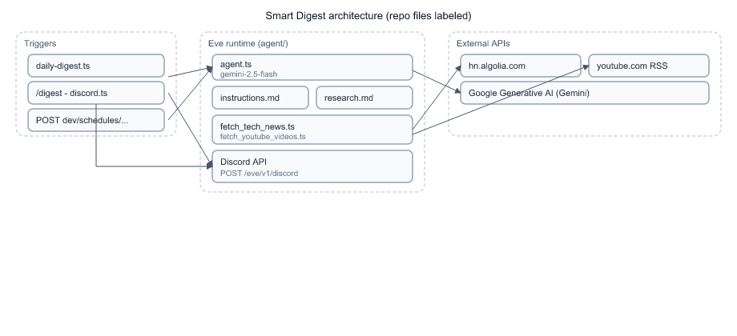

# Chapter 1: Basics and Architecture

You cloned a repo that looks small on disk — a handful of TypeScript files under `agent/` — but runs as a **durable AI agent** on a server, talks to Discord, fires on a cron, and calls external APIs. This chapter puts the mental model in place before you open individual files.

## What this project actually is

Smart Digest & Market Intelligence is a **daily engineering digest bot**. On each run it:

1. Pulls the top 15 Hacker News front-page stories (Algolia API).
2. Pulls recent uploads from your YouTube watchlist (public RSS, no API key).
3. Asks **Gemini 2.5 Flash** to filter, categorize, and write a short markdown digest.
4. Posts the result to Discord — either on a schedule or when someone runs `/digest`.

The "product" is not a web UI. The product is a **scheduled + on-demand agent session** that ends in a Discord message.

## Five concepts you need before reading code

| Concept | In this repo | Why it matters |
|---------|--------------|----------------|
| **Eve agent** | Everything under [`agent/`](../agent/) | Eve discovers files by convention — no central router you hand-wire. |
| **Tools** | [`fetch_tech_news.ts`](../agent/tools/fetch_tech_news.ts), [`fetch_youtube_videos.ts`](../agent/tools/fetch_youtube_videos.ts) | Deterministic HTTP fetches the model *calls*; it must not invent URLs. |
| **Skills** | [`research.md`](../agent/skills/research.md) | Markdown injected into context — editorial rules, not executable code. |
| **Channels** | [`discord.ts`](../agent/channels/discord.ts) | How inbound Discord traffic and outbound replies work. |
| **Schedules** | [`daily-digest.ts`](../agent/schedules/daily-digest.ts) | Cron triggers a **proactive** session without a human typing first. |

Eve (`eve@^0.11.7`) sits on the **Vercel AI SDK** (`ai@7.0.0-beta.178`) and compiles your `agent/` tree into a Nitro server (`.output/` locally, Vercel functions in production). You almost never import Eve internals — you export defaults from convention-named files and Eve wires them.

## Repo layout (what to open first)

```text
agent/
├── agent.ts              ← model only (Gemini)
├── instructions.md       ← workflow the model follows every run
├── channels/discord.ts   ← Discord HTTP interactions + /digest hook
├── schedules/daily-digest.ts
├── skills/research.md
├── tools/                ← HTTP ingestion
└── lib/                  ← config shared by schedule + Discord script
scripts/register-discord-commands.mjs   ← one-time Discord slash-command setup
```

Spec Kit artifacts live under [`specs/001-smart-digest-eve-agent/`](../specs/001-smart-digest-eve-agent/) — contracts and the original plan. They document *intent*; [`agent/`](../agent/) is what actually runs.

## Architecture: who talks to whom



*Notice:* ingestion tools and the LLM are separate boxes. That split is deliberate — URLs and scores come from code; judgment calls come from the model guided by `research.md`.

## What physically happens on one digest run

Concrete walkthrough when the cron fires at 08:00 UTC:

| Step | Actor | Action |
|------|-------|--------|
| 1 | Vercel cron | Hits Eve's generated cron route for `daily-digest.ts` |
| 2 | `daily-digest.ts` | Calls `receive(discord, { message: DIGEST_PROMPT, target: { channelId } })` |
| 3 | Eve | Starts a new agent session with `DIGEST_PROMPT` as the user turn |
| 4 | Gemini | Reads [`instructions.md`](../agent/instructions.md), loads `research` skill, calls `fetch_tech_news` |
| 5 | `fetch_tech_news` | `GET` Algolia → returns 15 `{ title, url, points }` objects |
| 6 | Gemini | Calls `fetch_youtube_videos` |
| 7 | `fetch_youtube_videos` | `GET` RSS per ID in [`youtube-config.ts`](../agent/lib/youtube-config.ts) |
| 8 | Gemini | Filters, groups, formats markdown per instructions |
| 9 | `discord.ts` events | `message.completed` → `channel.discord.post()` edits deferred reply or sends follow-ups |

The `/digest` slash command follows the same agent path from step 3 onward; only step 2 differs (Discord interaction instead of cron + `receive()`).

## Environment quirks (read once)

This repo pins **Node 24** (see [`.nvmrc`](../.nvmrc) and [`package.json`](../package.json) `engines`). Before any command:

```bash
nvm use
npm install --legacy-peer-deps   # peer-deps flag required for ai + eve pin
cp .env.example .env             # then fill keys — never commit .env
```

Required env vars for a full run: `GOOGLE_GENERATIVE_AI_API_KEY`, `DISCORD_PUBLIC_KEY`, `DISCORD_APPLICATION_ID`, `DISCORD_BOT_TOKEN`. The model uses **Google**, not `OPENAI_API_KEY` (a common misconfiguration on Vercel).

Discover what Eve compiled:

```bash
npm run info
```

## Design choice: filesystem-first vs a monolithic script

| Approach | This repo | Alternative rejected |
|----------|-----------|----------------------|
| Eve agent + tools + skills | Separate fetch code from LLM judgment; cron and slash share [`digest-prompt.ts`](../agent/lib/digest-prompt.ts) | Single Node script that fetches HN, calls OpenAI once, posts to Discord — faster to write, harder to extend (no slash command lifecycle, no Eve durability) |
| Gemini via `@ai-sdk/google` | Direct API key | Vercel AI Gateway — supported by Eve but not used here; one fewer hop |

The team accepted Eve's conventions (`defineTool`, `defineSchedule`, `discordChannel`) in exchange for Discord's 3-second ACK handling, workflow durability, and dev TUI — features you'd rebuild by hand in a script.

## Bridge to Chapter 2

You now know *who* participates in a digest run. Chapter 2 goes deep on the two ingestion tools — the only places this repo performs outbound HTTP to HN and YouTube — and exactly what JSON they return to the model.

## Try it out

Try each step yourself first — expand the solution only when stuck.

1. Run `npm run info` and find the HTTP routes Eve exposes for creating and continuing sessions.

   <details>
   <summary><b>Solution</b></summary>

   ```bash
   nvm use
   npm run info
   ```

   Look for the **Messaging** section. You should see:

   - `Create` → `POST /eve/v1/session`
   - `Continue` → `POST /eve/v1/session/:sessionId`
   - `Stream` → `GET /eve/v1/session/:sessionId/stream`

   These routes are generated by Eve from your `agent/` tree — you did not define them manually. That is the filesystem-first model: conventions produce the server.

   </details>

2. List every file Eve treats as a tool, skill, channel, and schedule without reading source — use the CLI only.

   <details>
   <summary><b>Solution</b></summary>

   ```bash
   npm run info
   ```

   Expected highlights:

   - **Skills**: `1 skill` → maps to [`agent/skills/research.md`](../agent/skills/research.md)
   - **Instructions**: `instructions.md`
   - **Output**: `.output/` (build artifact, gitignored)

   For a fuller manifest after build, inspect `.eve/discovery/agent-discovery-manifest.json` (also gitignored locally but regenerated on `npm run build`).

   </details>

3. Start the dev server headless on port 3000 and confirm the root URL responds.

   <details>
   <summary><b>Solution</b></summary>

   ```bash
   nvm use
   npx eve dev --no-ui --port 3000
   ```

   In another terminal:

   ```bash
   curl -s -o /dev/null -w "%{http_code}\n" http://127.0.0.1:3000/
   ```

   Expected: `200`. The agent UI is optional; production on Vercel never serves a human-facing app — only Eve API routes and Discord.

   </details>

4. Open [`agent/agent.ts`](../agent/agent.ts) and explain in one sentence why the file is only seven lines.

   <details>
   <summary><b>Solution</b></summary>

   ```typescript
   export default defineAgent({
     model: google("gemini-2.5-flash"),
   });
   ```

   Eve loads workflow, tools, channels, and schedules from other files under `agent/`. `agent.ts` only pins the **model provider**; behaviour lives in `instructions.md`, tools, and channel hooks. Keeping the entry point thin avoids duplicating config Eve already discovers by filename.

   </details>

5. Trace which file would run if you POST to `/eve/v1/dev/schedules/daily-digest` during local dev.

   <details>
   <summary><b>Solution</b></summary>

   Target: [`agent/schedules/daily-digest.ts`](../agent/schedules/daily-digest.ts), specifically the `run` handler:

   ```typescript
   async run({ receive, waitUntil, appAuth }) {
     waitUntil(
       receive(discord, {
         message: DIGEST_PROMPT,
         target: { channelId: DIGEST_CHANNEL_ID },
         auth: appAuth,
       }),
     );
   }
   ```

   Command (with dev server running):

   ```bash
   curl -X POST http://127.0.0.1:3000/eve/v1/dev/schedules/daily-digest
   ```

   Expected: HTTP 2xx and a new agent session kicked off toward Discord channel `DIGEST_CHANNEL_ID`. This route exists **only in dev** — production uses Vercel cron instead.

   </details>
