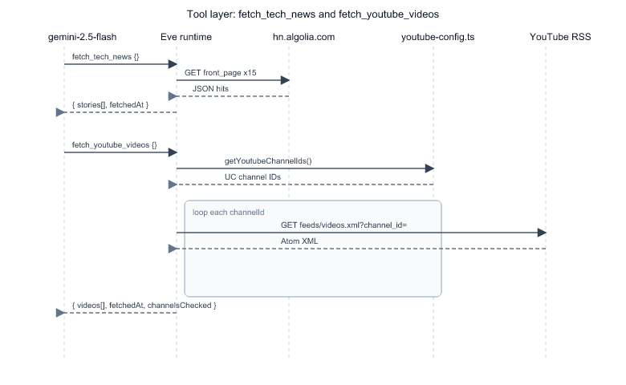

# Chapter 2: Ingestion Tools and Data Sources

Chapter 1 showed the digest as a pipeline. This chapter zooms into the **only two places** your repo talks to the outside world for content: Hacker News via Algolia and YouTube via RSS. Both are Eve **tools** — typed functions the model invokes through the AI SDK tool-calling loop, not prompts pretending to browse the web.

## Why tools instead of "please fetch HN in your head"

[`agent/instructions.md`](../agent/instructions.md) explicitly says: *"Use tools for all ingestion; never fabricate headlines or video URLs."* That rule exists because LLMs confidently invent plausible URLs. By forcing fetches through [`fetch_tech_news.ts`](../agent/tools/fetch_tech_news.ts) and [`fetch_youtube_videos.ts`](../agent/tools/fetch_youtube_videos.ts), every link in the digest traceably came from HTTP responses you can replay.

Trade-off: two round-trips to external APIs per run (latency + failure modes). Benefit: auditability and testability via curl/session without trusting model memory.

## Tool shape in Eve

Both tools follow the same skeleton:

```typescript
export default defineTool({
  description: "...",
  inputSchema: z.object({}),   // no parameters — operator config lives in lib/
  async execute() { ... },
});
```

| Field | Purpose in this repo |
|-------|----------------------|
| `description` | Tells Gemini when to call the tool |
| `inputSchema` | Empty object — watchlist and lookback are **not** model inputs; operators set them in [`youtube-config.ts`](../agent/lib/youtube-config.ts) |
| `execute` | Plain async TypeScript; runs in the app runtime with `fetch`, not in the sandbox |

**Rejected alternative:** Zod schema with `channelIds: z.array(z.string())` as tool args. That would let the model omit channels or hallucinate IDs. Config file + env override keeps the watchlist operator-controlled.

## `fetch_tech_news`: HN Algolia front page

Source: [`agent/tools/fetch_tech_news.ts`](../agent/tools/fetch_tech_news.ts)

```typescript
const HN_ALGOLIA_URL =
  "https://hn.algolia.com/api/v1/search?tags=front_page&hitsPerPage=15";
```

### Request → response walkthrough

Example (abbreviated) Algolia hit:

```json
{ "objectID": "123", "title": "Show HN: ...", "url": "https://example.com", "points": 142 }
```

| Step | Code location | Result |
|------|---------------|--------|
| 1 | `fetch(HN_ALGOLIA_URL)` | HTTP GET, throws if not `ok` |
| 2 | `data.hits.slice(0, 15)` | Cap at 15 even if API returns more |
| 3 | `storyUrl(hit)` | Prefer external `url`; else fall back to `https://news.ycombinator.com/item?id=${objectID}` |
| 4 | Filter nulls | Drops hits missing title or resolvable URL |
| 5 | Return object | `{ stories, fetchedAt, source: "hn_algolia_front_page" }` |

Returned story shape:

```typescript
{
  title: string;
  url: string;
  points: number;
  objectId?: string;
}
```

Algolia was chosen over scraping `news.ycombinator.com` HTML (see [`specs/.../research.md`](../specs/001-smart-digest-eve-agent/research.md)) — stable JSON, no HTML parser, public endpoint.

## `fetch_youtube_videos`: RSS per channel ID

Source: [`agent/tools/fetch_youtube_videos.ts`](../agent/tools/fetch_youtube_videos.ts)

```typescript
const YOUTUBE_RSS_BASE = "https://www.youtube.com/feeds/videos.xml";
// GET ...?channel_id=UCxxxxxxxxxxxxxxxxxxxxxxxxxx
```

### Config resolution order

[`getYoutubeChannelIds()`](../agent/lib/youtube-config.ts) in [`youtube-config.ts`](../agent/lib/youtube-config.ts):

1. If `YOUTUBE_CHANNEL_IDS` env var is set (comma-separated) → use that.
2. Else → use `YOUTUBE_CHANNEL_IDS` array in the file.

IDs must match `/^UC[\w-]{22}$/` or they are skipped with a console warning.

Lookback window: `YOUTUBE_LOOKBACK_HOURS` (currently **120** hours in the file). Entries older than that are dropped in `isWithinLookback`.

### Per-channel fetch walkthrough

For channel `UCsBjURrPoezykLs9EqgamOA`:

| Step | Function | Notes |
|------|----------|-------|
| 1 | `fetchChannelVideos(id, lookbackHours)` | One RSS GET per channel |
| 2 | `parseFeedEntries(xml)` | Regex splits `<entry>...</entry>` blocks |
| 3 | `extractTag` / `extractLinkHref` | Minimal XML parsing — no dependency |
| 4 | `isWithinLookback(publishedAt, ...)` | Compares `Date.parse` to cutoff |
| 5 | Push to `videos[]` | `{ title, url, channelId, channelName, publishedAt }` |

After all channels: sort by `publishedAt` descending. Partial failure is allowed — one bad channel logs a warning; all failing throws.

**Rejected alternative:** YouTube Data API v3 — requires API key, quota, and OAuth complexity. RSS is read-only, unauthenticated, and sufficient for "recent uploads from known channels."

## Data flow through the tool layer



*Notice:* the model never passes channel IDs. Configuration stays in `lib/` — the same pattern as Discord's `DIGEST_CHANNEL_ID`.

## Error behaviour the model must handle

| Failure | Tool behaviour | Instruction expectation |
|---------|----------------|------------------------|
| Algolia down | Throws | Report error; do not invent stories |
| One YouTube channel 404 | Warn; continue | Partial video list OK |
| All YouTube channels fail | Throws | Same as Algolia |
| Empty watchlist | Returns `{ videos: [], channelsChecked: 0 }` | Omit Must-Watch section |

These paths are spelled out in [`instructions.md`](../agent/instructions.md) empty-state section — the tools throw or return empty; the model decides what to post.

## Bridge to Chapter 3

Tools supply **raw candidates**. Chapter 3 covers what happens next: Gemini loads the `research` skill, applies editorial rules, and synthesizes the markdown digest format before Discord ever sees a message.

## Try it out

Try each step yourself first — expand the solution only when stuck.

1. Invoke only `fetch_tech_news` through a dev session and inspect the JSON shape.

   <details>
   <summary><b>Solution</b></summary>

   With `npx eve dev --no-ui --port 3000` running:

   ```bash
   curl -X POST http://127.0.0.1:3000/eve/v1/session \
     -H 'content-type: application/json' \
     -d '{"message":"Call fetch_tech_news only. Return the titles and points of the first 3 stories as plain text."}'
   ```

   Watch the streamed response or session output. You should see real HN titles and numeric `points` from Algolia — proof the tool ran, not cached training data.

   </details>

2. Add an intentionally invalid channel ID to [`agent/lib/youtube-config.ts`](../agent/lib/youtube-config.ts) alongside a valid one, run the YouTube tool, and observe partial success.

   <details>
   <summary><b>Solution</b></summary>

   Temporarily edit:

   ```typescript
   export const YOUTUBE_CHANNEL_IDS = [
     "UCsBjURrPoezykLs9EqgamOA",
     "NOT_A_REAL_ID",
   ] as const;
   ```

   Restart dev server, then:

   ```bash
   curl -X POST http://127.0.0.1:3000/eve/v1/session \
     -H 'content-type: application/json' \
     -d '{"message":"Call fetch_youtube_videos and report videos found and any errors."}'
   ```

   Expected: console warning `[youtube-config] Skipping invalid channel ID: NOT_A_REAL_ID` (invalid pattern skipped before fetch) **or** if you use a malformed but UC-shaped ID, a fetch warning while valid channel still returns videos. Revert the edit when done.

   </details>

3. Hit Algolia directly with curl and compare to what the tool returns.

   <details>
   <summary><b>Solution</b></summary>

   ```bash
   curl -s 'https://hn.algolia.com/api/v1/search?tags=front_page&hitsPerPage=15' \
     | node -e "let d='';process.stdin.on('data',c=>d+=c);process.stdin.on('end',()=>{const j=JSON.parse(d);console.log(j.hits.slice(0,3).map(h=>({title:h.title,points:h.points})));})"
   ```

   Compare the first three titles to a tool call session. They should match — the tool is a thin, typed wrapper over this endpoint.

   </details>

4. Change `YOUTUBE_LOOKBACK_HOURS` to `1` and explain how many videos you get back for a quiet channel.

   <details>
   <summary><b>Solution</b></summary>

   In [`agent/lib/youtube-config.ts`](../agent/lib/youtube-config.ts), set:

   ```typescript
   export const YOUTUBE_LOOKBACK_HOURS = 1;
   ```

   Restart dev server, call `fetch_youtube_videos` via session. Most runs return **zero or few** videos because uploads older than one hour are filtered in `isWithinLookback`. This shows lookback is enforced in tool code, not by the model. Restore `120` (or your preferred value) afterward.

   </details>

5. Read `storyUrl()` in [`fetch_tech_news.ts`](../agent/tools/fetch_tech_news.ts) and predict the URL for a hit with `url: null` and `objectID: "424242"`.

   <details>
   <summary><b>Solution</b></summary>

   ```typescript
   if (hit.objectID) {
     return `https://news.ycombinator.com/item?id=${hit.objectID}`;
   }
   ```

   Expected URL: `https://news.ycombinator.com/item?id=424242`. Ask HN posts often lack an external URL; this fallback prevents dropping otherwise valid stories.

   </details>
