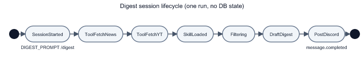

# Chapter 3: Agent Instructions, Skills, and Synthesis

Chapter 2 ended with raw `{ stories[] }` and `{ videos[] }` in the model's context. This chapter covers the **judgment layer**: what Gemini is told to do with that data, how the `research` skill steers filtering, and how [`digest-prompt.ts`](../agent/lib/digest-prompt.ts) keeps scheduled and manual runs aligned.

## Three layers of "prompt" in this repo

| Layer | File | Mutable by | Role |
|-------|------|------------|------|
| System behaviour | [`instructions.md`](../agent/instructions.md) | You, in git | Permanent workflow: ingest → filter → synthesize → deliver |
| Editorial lens | [`skills/research.md`](../agent/skills/research.md) | You, in git | Include/exclude rules; loaded on demand via skill name `research` |
| Run trigger text | [`digest-prompt.ts`](../agent/lib/digest-prompt.ts) | You, in git | Short imperative paragraph for cron + `/digest` |

Eve loads `instructions.md` automatically for every session. Skills are **not** always in context — [`DIGEST_PROMPT`](../agent/lib/digest-prompt.ts) step 3 says *"Load the research skill"*, nudging the model to pull [`research.md`](../agent/skills/research.md) when curating.

**Why split instructions vs skill?** Instructions describe *procedure* (tool order, Discord format, empty states). The skill describes *taste* (what counts as engineer-growth signal). You can tighten filtering without rewriting delivery rules — useful when operators disagree on hype vs depth.

## Walking the instruction workflow

From [`instructions.md`](../agent/instructions.md), the ordered steps on each digest:

```markdown
1. Ingest — fetch_tech_news first, then fetch_youtube_videos
2. Filter — Load research skill, apply criteria
3. Synthesize news — bold categories, bullets with title/points/link
4. Synthesize videos — up to 3 Must-Watch with Why:
5. Deliver — post markdown to Discord
```

Concrete state transition (simplified):

| After step | Context contains | Model obligation |
|------------|------------------|----------------|
| Ingest | ~15 stories + N videos | Must not skip tools |
| Filter | Same items, mentally tagged | Drop funding hype, listicles |
| Synthesize news | Subset of stories | 1–4 category headers |
| Synthesize videos | ≤3 videos | Each needs `Why:` line |
| Deliver | Final markdown string | No `@everyone`; respect 2000-char Discord limit |

The model provider is pinned in [`agent.ts`](../agent/agent.ts):

```typescript
export default defineAgent({
  model: google("gemini-2.5-flash"),
});
```

Gemini Flash is a cost/latency trade-off: fast enough for a daily cron, capable enough for categorization. **Rejected for this repo:** GPT-4o (early plan in [`specs/.../plan.md`](../specs/001-smart-digest-eve-agent/plan.md)) — switched to Gemini with `GOOGLE_GENERATIVE_AI_API_KEY`; cheaper and already integrated via `@ai-sdk/google`.

## The research skill: editorial rules as markdown

[`agent/skills/research.md`](../agent/skills/research.md) front matter:

```yaml
---
description: Apply engineer-growth filtering when curating the daily Smart Digest...
---
```

Eve exposes this as skill name **`research`** (filename without extension). Key rules the model should enforce:

- **Include:** architecture postmortems, infra (Rails, Redis, K8s), AI agent engineering with implementation detail.
- **Exclude:** generic funding news, marketing launches, listicles, lifestyle vlogs.
- **Videos:** max 3 picks, each with `Why:`; skip shorts/sponsor fluff.

The skill does not execute code. It changes token probabilities when the model reads it — same mechanism as a detailed system appendix. **Trade-off:** compliance is probabilistic, not guaranteed. **Mitigation:** tools already removed fake URLs; worst case is over-filtering or bland categories, not fabricated links.

## Output contract: Discord markdown

Instructions embed a template the model must approximate:

```markdown
**Smart Digest — YYYY-MM-DD**

**Infrastructure**
• Story title (123 pts) — https://...

**Must-Watch**
• *Video title* — Channel Name — https://youtube.com/...
  Why: One line on what the engineer will learn.
```

Empty digest still posts:

```markdown
**Smart Digest — YYYY-MM-DD**

No high-signal engineering items today.
```

Silence on empty runs was explicitly rejected — operators need confirmation the bot ran.

## Shared trigger: `DIGEST_PROMPT`

[`agent/lib/digest-prompt.ts`](../agent/lib/digest-prompt.ts) exports one string used by:

- [`daily-digest.ts`](../agent/schedules/daily-digest.ts) → `message: DIGEST_PROMPT` in `receive()`
- [`discord.ts`](../agent/channels/discord.ts) → `context: [DIGEST_PROMPT]` when command is `digest`

For slash commands, Eve's default user message is `/digest`; the full workflow lands in **context** lines appended after Discord metadata (see Eve's `onCommand` → `send({ message, context })` path). **Rejected:** duplicating the prompt string in schedule and Discord files — drift guaranteed within a week.

## Synthesis lifecycle



*Notice:* there is no persistent "digest state" in your database — each run is a fresh Eve session. Durability is session/workflow-level (Eve retries, streaming), not "remember yesterday's stories."

## Bridge to Chapter 4

The model eventually emits a markdown string. Chapter 4 covers **delivery mechanics**: how Discord receives it, why slash commands need a deferred ACK, and how the cron uses `receive()` to post proactively to [`DIGEST_CHANNEL_ID`](../agent/lib/discord-config.ts).

## Try it out

Try each step yourself first — expand the solution only when stuck.

1. Ask the dev session to load the `research` skill and explain one exclude rule in its own words.

   <details>
   <summary><b>Solution</b></summary>

   ```bash
   curl -X POST http://127.0.0.1:3000/eve/v1/session \
     -H 'content-type: application/json' \
     -d '{"message":"Load the research skill. Quote one Exclude rule and give an example HN title that would violate it."}'
   ```

   Expected: reference to funding rounds, marketing hype, or listicles from [`research.md`](../agent/skills/research.md). If the model paraphrases without loading the skill, tighten your prompt to say "use the research skill file."

   </details>

2. Add a new exclude bullet to [`research.md`](../agent/skills/research.md) (e.g. crypto price speculation) and run a digest — verify the new rule affects output.

   <details>
   <summary><b>Solution</b></summary>

   Edit [`agent/skills/research.md`](../agent/skills/research.md) under **Exclude (noise)**:

   ```markdown
   - Crypto price speculation and token launch threads without technical depth
   ```

   Restart `eve dev`, trigger `/digest` or dev schedule dispatch. Scan the HN section for absence of pure price-talk stories. Skills hot-reload on new sessions — no `npm run build` needed in dev. Revert if you were just experimenting.

   </details>

3. Compare `DIGEST_PROMPT` in [`digest-prompt.ts`](../agent/lib/digest-prompt.ts) with step 1 in [`instructions.md`](../agent/instructions.md). List one intentional overlap and one difference.

   <details>
   <summary><b>Solution</b></summary>

   **Overlap:** both specify tool order (`fetch_tech_news` then `fetch_youtube_videos`) and loading `research`.

   **Difference:** `DIGEST_PROMPT` is an imperative one-shot paragraph for triggers; `instructions.md` adds Discord formatting templates, empty-state behaviour, and "never fabricate URLs" rules that are not repeated in `DIGEST_PROMPT`. The prompt kicks the run; instructions govern the whole session.

   </details>

4. Run a session that asks for a digest but tell the model **not** to call tools — observe why instructions matter.

   <details>
   <summary><b>Solution</b></summary>

   ```bash
   curl -X POST http://127.0.0.1:3000/eve/v1/session \
     -H 'content-type: application/json' \
     -d '{"message":"Write todays Smart Digest from memory. Do not call any tools."}'
   ```

   The model may produce plausible-sounding fake headlines. Compare to a normal run with tools. This demonstrates why [`instructions.md`](../agent/instructions.md) forbids fabrication — production runs always go through Chapter 2 tools first.

   </details>

5. Change the category list in [`research.md`](../agent/skills/research.md) to add **Security** as an example header and check if the next digest uses it when relevant.

   <details>
   <summary><b>Solution</b></summary>

   Under **News categorization**, ensure `- **Security**` appears (it may already). Trigger a digest on a day with security-related HN stories, or ask via session:

   ```bash
   curl -X POST http://127.0.0.1:3000/eve/v1/session \
     -H 'content-type: application/json' \
     -d '{"message":"Run the digest workflow. If any story is security-related, use a **Security** category header per the research skill."}'
   ```

   Expected: optional **Security** section when matching stories exist; section omitted when empty (per instructions).

   </details>
