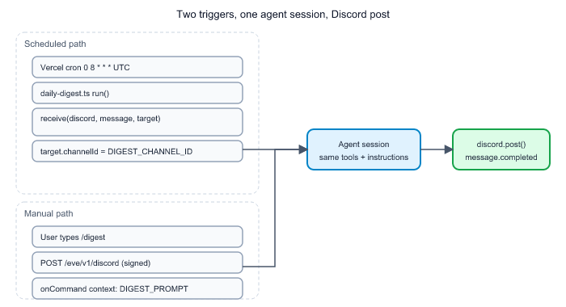
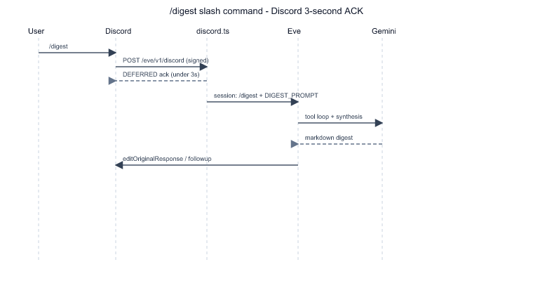

# Chapter 4: Discord Channels, Schedules, and Triggers

Chapter 3 ended with markdown ready to post. This chapter covers **how that text reaches Discord** — the channel adapter, two trigger paths (cron vs slash command), and the operator setup script that registers `/digest`.

## Discord in Eve: HTTP interactions, not a gateway bot

[`agent/channels/discord.ts`](../agent/channels/discord.ts) exports:

```typescript
export default discordChannel({
  onCommand(_ctx, interaction) { ... },
});
```

Eve serves **`POST /eve/v1/discord`** (production: `https://smart-digest-market-intelligence-ev.vercel.app/eve/v1/discord`). Discord sends signed interaction payloads there — not a persistent WebSocket gateway.

| Requirement | Env var | Purpose |
|-------------|---------|---------|
| Verify signatures | `DISCORD_PUBLIC_KEY` | Ed25519 check on every inbound request |
| Reply to interactions | `DISCORD_APPLICATION_ID` | Edit deferred responses |
| Proactive + typing | `DISCORD_BOT_TOKEN` | Cron posts, follow-ups, typing indicator |

**Trade-off:** HTTP interactions fit serverless (Vercel) perfectly. **Cost:** you must register slash commands yourself — Eve does not do that for you ([`scripts/register-discord-commands.mjs`](../scripts/register-discord-commands.mjs)).

## Two ways to start the same digest



*Notice:* scheduled digests always land in [`DIGEST_CHANNEL_ID`](../agent/lib/discord-config.ts) (`1517880826061394010` in the committed file). `/digest` posts in **whatever channel the user ran the command** — same workflow, different delivery target.

### Scheduled: proactive `receive()`

[`agent/schedules/daily-digest.ts`](../agent/schedules/daily-digest.ts):

```typescript
export default defineSchedule({
  cron: "0 8 * * *",
  async run({ receive, waitUntil, appAuth }) {
    waitUntil(
      receive(discord, {
        message: DIGEST_PROMPT,
        target: { channelId: DIGEST_CHANNEL_ID },
        auth: appAuth,
      }),
    );
  },
});
```

| Detail | Meaning |
|--------|---------|
| `cron: "0 8 * * *"` | 08:00 **UTC** daily — Vercel cron is UTC-only |
| `waitUntil(...)` | Serverless-friendly: respond to cron quickly, work continues |
| `appAuth` | Session authenticated as the app, not a Discord user |
| `receive(discord, ...)` | Starts session **without** a user typing first |

**Rejected:** `@everyone` ping in channel — instructions forbid role mentions; digest should not wake the whole server.

### Manual: `/digest` slash command

[`discord.ts`](../agent/channels/discord.ts) custom hook:

```typescript
if (interaction.commandName === DIGEST_COMMAND_NAME) {
  return {
    auth: defaultDiscordAuth(interaction),
    context: [DIGEST_PROMPT],
  };
}
```

Sequence for slash commands (Discord 3-second rule):



Eve's default `message.completed` handler calls `channel.discord.post(message)` — first reply edits the deferred interaction; long digests split across follow-ups (2000-char limit).

Unsigned POST returns **401** — that is correct behaviour (your smoke test in the README).

## Registering the slash command

[`scripts/register-discord-commands.mjs`](../scripts/register-discord-commands.mjs) PUTs global commands:

```javascript
{
  name: DIGEST_COMMAND_NAME,  // "digest" from digest-prompt.ts
  description: "Run the Smart Digest now (HN + YouTube → filtered summary)",
  type: 1,
}
```

Run locally:

```bash
npm run discord:register-commands
```

Which executes `node --env-file=.env scripts/register-discord-commands.mjs` (Node 24 `--env-file` reads [`.env`](../.env.example) without dotenv dependency).

**Important:** `PUT /applications/{id}/commands` **replaces all** global commands. This repo registers only `/digest`. If you add more commands, include them in the same array.

Command name stays in sync via import from [`digest-prompt.ts`](../agent/lib/digest-prompt.ts) — same DRY pattern as the prompt text.

## Config file vs env for Discord channel

[`agent/lib/discord-config.ts`](../agent/lib/discord-config.ts):

```typescript
export const DIGEST_CHANNEL_ID = "1517880826061394010";
```

Only the **schedule** uses this constant. Slash commands ignore it. **Rejected:** env var for channel ID in v1 — file constant is simpler for a single-channel bot; YouTube watchlist already established the env-override pattern in [`youtube-config.ts`](../agent/lib/youtube-config.ts) where multi-value overrides matter more.

## Bridge to Chapter 5

You can trigger and deliver digests locally and on Vercel. Chapter 5 covers **verification without an automated test suite**, GitHub → Vercel deploy flow, and the env-var checklist that breaks production when wrong keys are set.

## Try it out

Try each step yourself first — expand the solution only when stuck.

1. Register `/digest` against your Discord application and confirm it appears in the client.

   <details>
   <summary><b>Solution</b></summary>

   ```bash
   nvm use
   cp .env.example .env   # if needed — fill DISCORD_APPLICATION_ID, DISCORD_BOT_TOKEN
   npm run discord:register-commands
   ```

   Expected stdout:

   ```text
   Registered 1 global command(s): /digest
   ```

   In Discord, type `/` in a server where the bot is installed — `/digest` should autocomplete (global commands can take a few minutes).

   </details>

2. POST unsigned JSON to the Discord route on production and interpret the status code.

   <details>
   <summary><b>Solution</b></summary>

   ```bash
   curl -s -o /dev/null -w "%{http_code}\n" \
     -X POST https://smart-digest-market-intelligence-ev.vercel.app/eve/v1/discord \
     -H 'content-type: application/json' -d '{}'
   ```

   Expected: `401`. Discord requests include `X-Signature-Ed25519` and `X-Signature-Timestamp`; Eve rejects unsigned probes. A 401 here means the route is live, not that the bot is broken.

   </details>

3. Fire the dev-only schedule dispatch and confirm a session starts (watch dev server logs).

   <details>
   <summary><b>Solution</b></summary>

   Terminal 1:

   ```bash
   nvm use
   npx eve dev --no-ui --port 3000
   ```

   Terminal 2:

   ```bash
   curl -X POST http://127.0.0.1:3000/eve/v1/dev/schedules/daily-digest
   ```

   Expected: HTTP success and log activity showing tool calls and Discord post attempts toward `DIGEST_CHANNEL_ID`. Requires valid `.env` Discord + Google keys.

   </details>

4. Read [`discord.ts`](../agent/channels/discord.ts) and explain what happens if someone registers a different slash command name than `digest` without updating the hook.

   <details>
   <summary><b>Solution</b></summary>

   The `onCommand` hook only injects `DIGEST_PROMPT` when `interaction.commandName === DIGEST_COMMAND_NAME` (`"digest"`). Any other command still dispatches with default auth but **without** the digest context — the model sees `/other-command`, not the full workflow paragraph. Registration script and hook must stay aligned via [`digest-prompt.ts`](../agent/lib/digest-prompt.ts).

   </details>

5. Compare where `DIGEST_PROMPT` is passed as `message` vs `context` and why both paths exist.

   <details>
   <summary><b>Solution</b></summary>

   - **Schedule** ([`daily-digest.ts`](../agent/schedules/daily-digest.ts)): `message: DIGEST_PROMPT` — proactive session has no slash text; the prompt *is* the user turn.
   - **Slash** ([`discord.ts`](../agent/channels/discord.ts)): user message is `/digest`; `context: [DIGEST_PROMPT]` appends workflow steps per Eve's Discord channel contract.

   Same instructions executed; different Eve API shapes for proactive vs interactive entry.

   </details>
