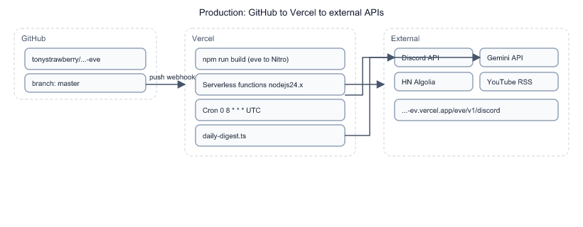

# Chapter 5: Manual Verification and Deployment

This repo ships **no automated test suite** — no `*.test.ts`, no CI test job. Verification is deliberate smoke testing via `eve dev`, HTTP session API, and Discord. This chapter explains that choice, how to verify behaviour yourself, and how the project runs on Vercel with GitHub auto-deploy.

## What is (and is not) tested

From [`specs/001-smart-digest-eve-agent/plan.md`](../specs/001-smart-digest-eve-agent/plan.md):

| Area | v1 approach | Rationale |
|------|-------------|-----------|
| Tool HTTP logic | Manual curl + session | Small surface; Algolia/RSS are live APIs |
| Model filtering | Eyeball Discord output | LLM output is non-deterministic |
| Discord delivery | `/digest` + schedule dispatch | Requires real Discord credentials |
| Compile | `npm run build` | Catches TypeScript/Eve discovery errors |

**Deliberately not tested:** snapshot tests on digest markdown (would flake daily), mocked Gemini responses (would hide prompt regressions), multi-channel routing (out of scope).

**Trade-off:** faster v1 ship. **Cost:** regressions caught by operator smoke tests, not CI. When you add tests, start with **pure functions** in tools (`storyUrl`, `isWithinLookback`, `validateChannelIds`) — the Chapter 2 split makes that straightforward.

## Manual verification checklist

Run after any change to tools, instructions, or Discord wiring:

| # | Command / action | Pass criteria |
|---|------------------|---------------|
| 1 | `npm run build` | Exit 0; Eve compile ready |
| 2 | `npm run info` | 0 diagnostics errors |
| 3 | Session tool smoke | `fetch_tech_news` returns 15 stories |
| 4 | Dev schedule | `POST .../dev/schedules/daily-digest` starts session |
| 5 | Discord `/digest` | Bot replies with formatted digest in channel |
| 6 | Unsigned Discord POST | Production returns `401` |

Session smoke (from [`README.md`](../README.md)):

```bash
npx eve dev --no-ui --port 3000

curl -X POST http://127.0.0.1:3000/eve/v1/session \
  -H 'content-type: application/json' \
  -d '{"message":"Call fetch_tech_news and summarize the top 3 stories."}'
```

## Deployment topology



*Notice:* Git push replaces manual `vercel --prod` for routine deploys once the repo is linked. CLI deploys still work but are redundant.

Production URL (alias): `https://smart-digest-market-intelligence-ev.vercel.app`

Discord Interactions Endpoint must match:

```text
https://smart-digest-market-intelligence-ev.vercel.app/eve/v1/discord
```

## Environment variables on Vercel

| Variable | Required | Common mistake |
|----------|----------|----------------|
| `GOOGLE_GENERATIVE_AI_API_KEY` | Yes | Setting only `OPENAI_API_KEY` — model is Gemini in [`agent.ts`](../agent/agent.ts) |
| `DISCORD_PUBLIC_KEY` | Yes | Wrong key → Discord endpoint verification fails |
| `DISCORD_APPLICATION_ID` | Yes | Mismatch breaks interaction replies |
| `DISCORD_BOT_TOKEN` | Yes | Missing → proactive cron posts fail |
| `YOUTUBE_CHANNEL_IDS` | Optional | Overrides file watchlist; comma-separated UC IDs |

After changing env vars on Vercel, **redeploy** — variables are baked in at deploy time for serverless functions.

File-based config that **does** require redeploy when changed in git:

- [`DIGEST_CHANNEL_ID`](../agent/lib/discord-config.ts)
- [`YOUTUBE_CHANNEL_IDS`](../agent/lib/youtube-config.ts) (unless overridden by env)

## GitHub → Vercel flow (concrete)

Observed on this project:

1. Link repo in Vercel dashboard → `productionBranch: master`.
2. Push to `master` → deployment builds in ~15s (`githubDeployment: 1` in deployment meta).
3. Production alias points to latest Ready deployment.

Verify latest deploy source:

```bash
vercel ls smart-digest-market-intelligence-eve
```

Look for the newest **Production** row after your push. Git-sourced deploys include `githubCommitSha` in metadata (via Vercel API).

**Rejected:** deploying only from laptop CLI without git — production drifted from GitHub until the repo was linked; git push is now source of truth.

## Cron behaviour in production vs dev

| Environment | Cron fires? | Manual trigger |
|-------------|-------------|----------------|
| `eve dev` | No | `POST /eve/v1/dev/schedules/daily-digest` |
| Vercel prod | Yes, 08:00 UTC | `/digest` in Discord |

Adjust [`cron: "0 8 * * *"`](../agent/schedules/daily-digest.ts) for local timezone needs — there is no automatic JST conversion.

## Operator scripts reference

| Script | When to run |
|--------|-------------|
| `npm run build` | Before deploy; CI/Vercel runs automatically |
| `npm run discord:register-commands` | After creating Discord app or changing slash metadata |
| `npm run dev` | Local iteration with TUI |
| `npx eve dev --no-ui --port 3000` | Headless local server matching README smoke tests |

## Failure modes you will actually hit

| Symptom | Likely cause | Fix |
|---------|--------------|-----|
| "Model provider API key missing" | `GOOGLE_GENERATIVE_AI_API_KEY` not on Vercel | Add key; redeploy |
| Discord endpoint verify 401 | Bad `DISCORD_PUBLIC_KEY` | Copy from Developer Portal → Production env |
| `/digest` missing | Commands not registered | `npm run discord:register-commands` |
| Empty Must-Watch | No uploads in lookback window | Increase `YOUTUBE_LOOKBACK_HOURS` or check channel ID |
| Cron silent | Wrong `DIGEST_CHANNEL_ID` or bot lacks channel perms | Fix config; invite bot with Send Messages |

## Where to go next

You have walked the full path: **trigger → agent → tools → skill → Discord**, plus how it lands on Vercel. Deeper contracts live in [`specs/001-smart-digest-eve-agent/contracts/`](../specs/001-smart-digest-eve-agent/contracts/). Eve framework docs cover features this repo has not used yet (evals, sandbox tools, additional channels).

## Try it out

Try each step yourself first — expand the solution only when stuck.

1. Run `npm run build` and confirm Eve reports a successful compile with no diagnostics.

   <details>
   <summary><b>Solution</b></summary>

   ```bash
   nvm use
   npm run build
   ```

   Expected: `[BUILD] built output at .../.output` and exit code 0. Optionally:

   ```bash
   npm run info
   ```

   Look for `Diagnostics   0 errors, 0 warnings`.

   </details>

2. Simulate the README session smoke test and confirm the response references real HN titles from today.

   <details>
   <summary><b>Solution</b></summary>

   Start dev server, then:

   ```bash
   curl -X POST http://127.0.0.1:3000/eve/v1/session \
     -H 'content-type: application/json' \
     -d '{"message":"Call fetch_tech_news and summarize the top 3 stories."}'
   ```

   Cross-check one title against https://news.ycombinator.com/ front page. Match confirms live ingestion, not stale model knowledge.

   </details>

3. List Vercel production env var **names** (not values) and verify `GOOGLE_GENERATIVE_AI_API_KEY` is present.

   <details>
   <summary><b>Solution</b></summary>

   ```bash
   vercel env ls
   ```

   Expected names include at minimum:

   - `GOOGLE_GENERATIVE_AI_API_KEY`
   - `DISCORD_PUBLIC_KEY`
   - `DISCORD_APPLICATION_ID`
   - `DISCORD_BOT_TOKEN`

   If `OPENAI_API_KEY` exists but Google key does not, `/digest` will fail with provider key errors until fixed.

   </details>

4. Extract one pure function from [`fetch_youtube_videos.ts`](../agent/tools/fetch_youtube_videos.ts) into a new file and write a one-line Node assertion — this is how you would start automated testing.

   <details>
   <summary><b>Solution</b></summary>

   Create `agent/lib/youtube-lookback.ts`:

   ```typescript
   export function isWithinLookback(publishedAt: string, lookbackHours: number): boolean {
     const published = Date.parse(publishedAt);
     if (Number.isNaN(published)) return false;
     const cutoff = Date.now() - lookbackHours * 60 * 60 * 1000;
     return published >= cutoff;
   }
   ```

   Quick check without a test framework:

   ```bash
   node --input-type=module -e "
   import { isWithinLookback } from './agent/lib/youtube-lookback.ts';
   const hourAgo = new Date(Date.now() - 30 * 60 * 1000).toISOString();
   console.assert(isWithinLookback(hourAgo, 1) === true);
   console.log('ok');
   "
   ```

   Expected: `ok`. This mirrors the plan's note that pure splits from Chapter 2 are the easiest first tests — you would then import this from the tool file in a real PR.

   </details>

5. Push an empty commit to `master` and confirm Vercel starts a new Production deployment.

   <details>
   <summary><b>Solution</b></summary>

   ```bash
   git commit --allow-empty -m "chore: verify deploy hook"
   git push origin master
   ```

   Within ~30 seconds:

   ```bash
   vercel ls smart-digest-market-intelligence-eve
   ```

   Expected: new row at top, Status Building → Ready, Environment Production. Confirms GitHub integration from Chapter 1 architecture is operational.

   </details>
